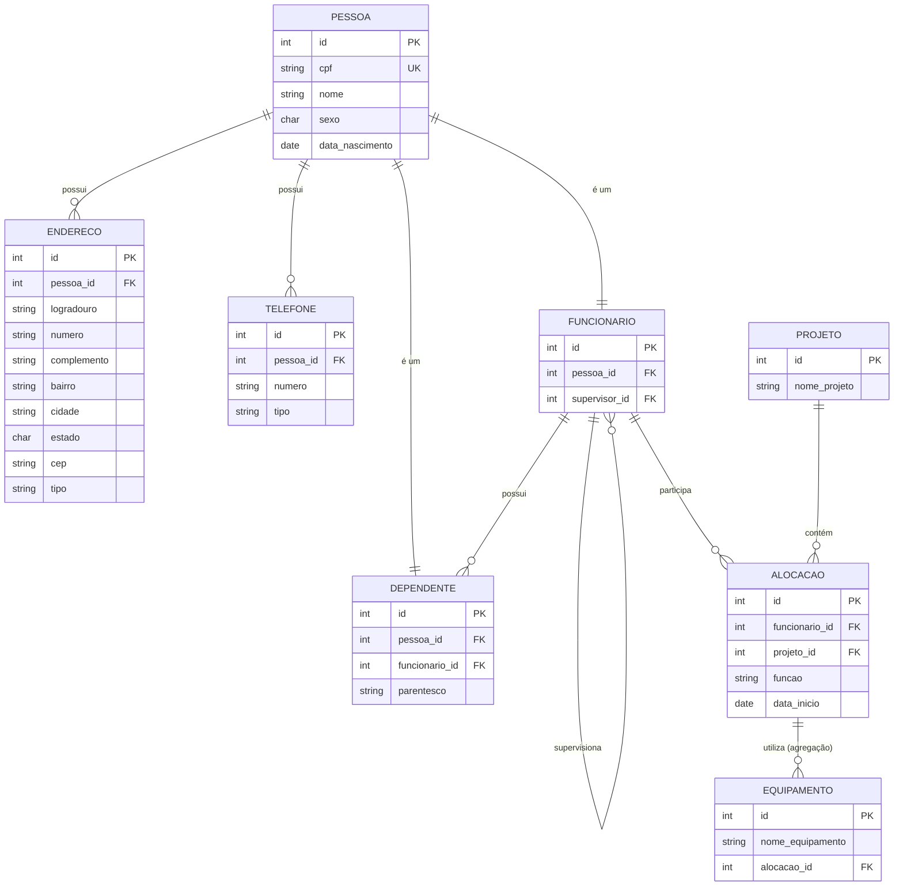

# Projeto BD — Agregação, Entidade Fraca e Autorelacionamento

Modelo relacional em PostgreSQL aplicando os conceitos de **autorelacionamento**,
**entidade fraca (dependência de existência)** e **agregação**, normalizado até a 3ª Forma Normal (3FN).

---

## Diagrama ER



---

## Decisão de modelagem — Tabela Pessoa como base

A tabela `pessoa` centraliza os dados comuns a qualquer indivíduo no sistema
(cpf, nome, sexo, data de nascimento). Tanto `funcionario` quanto `dependente`
herdam de `pessoa` via `pessoa_id FK`, evitando repetição de atributos — o que
mantém a 3FN: nenhum dado pessoal fica duplicado em outra tabela.

---

## Endereço subatômico

O endereço foi decomposto em colunas atômicas (`logradouro`, `numero`,
`complemento`, `bairro`, `cidade`, `estado`, `cep`) em uma tabela separada,
pois uma pessoa pode ter vários endereços. Isso satisfaz a 1FN (sem grupos
repetitivos) e evita dependências transitivas que violariam a 3FN.

---

## Telefone

Separado em tabela própria pelo mesmo motivo: uma pessoa pode ter múltiplos
telefones. O campo `tipo` controla se é `celular`, `residencial` ou `comercial`.

---

## Autorelacionamento — Hierarquia de Supervisão

A tabela `funcionario` referencia ela mesma por meio de `supervisor_id`.
Permite hierarquias de qualquer profundidade. A coluna é nullable
(`ON DELETE SET NULL`), pois o funcionário no topo não possui supervisor.

```sql
supervisor_id INTEGER REFERENCES funcionario(id) ON DELETE SET NULL
```

Para listar cada funcionário ao lado do nome do seu supervisor:

```sql
SELECT f.nome AS funcionario, s.nome AS supervisor
FROM funcionario f
LEFT JOIN funcionario s ON f.supervisor_id = s.id;
```

---

## Entidade Fraca — Dependente

`dependente` é uma entidade fraca: não pode existir sem estar vinculada a um
`funcionario`. Os dados pessoais (nome, sexo, data de nascimento) ficam em
`pessoa`, referenciados por `pessoa_id FK`. O vínculo com o funcionário é feito
por `funcionario_id FK NOT NULL` com `ON DELETE CASCADE` — se o funcionário for
removido, todos os seus dependentes são removidos automaticamente.

```sql
CREATE TABLE dependente (
    id            SERIAL PRIMARY KEY,
    pessoa_id     INTEGER NOT NULL REFERENCES pessoa(id),
    funcionario_id INTEGER NOT NULL,
    parentesco    VARCHAR(50),
    CONSTRAINT fk_dependente_funcionario
        FOREIGN KEY (funcionario_id)
        REFERENCES funcionario(id)
        ON DELETE CASCADE
);
```

---

## Agregação — Equipamentos vinculados a uma Alocação

O relacionamento entre `funcionario` e `projeto` é materializado como a entidade
`alocacao`, com `id` próprio como chave primária. Isso permite que outros elementos
referenciem a alocação como um todo.

A tabela `equipamento` referencia `alocacao` via `alocacao_id FK`, declarando
formalmente que o equipamento pertence à alocação — não a um funcionário ou
projeto isolado:

```sql
CREATE TABLE equipamento (
    id              SERIAL PRIMARY KEY,
    nome_equipamento VARCHAR(100) NOT NULL,
    alocacao_id     INTEGER NOT NULL,
    CONSTRAINT fk_equipamento_alocacao
        FOREIGN KEY (alocacao_id)
        REFERENCES alocacao(id)
        ON DELETE CASCADE
);
```

Isso mantém o modelo na 3FN: `nome_equipamento` depende exclusivamente de `id`,
sem dependências transitivas.

---

## Decisão de modelagem — CPF como UNIQUE, não como PK

O CPF está em `pessoa` como `VARCHAR(14) NOT NULL UNIQUE`.
A chave primária técnica continua sendo `id SERIAL`, pelos seguintes motivos:

- **Performance**: FKs com `INTEGER` são mais leves que `VARCHAR(14)` em joins e índices.
- **Estabilidade**: CPF pode precisar de correção cadastral — uma PK string que muda quebra todas as FKs em cascata.
- **Boas práticas**: separar identidade de negócio (CPF) da identidade técnica (id) é o padrão adotado pela indústria.
